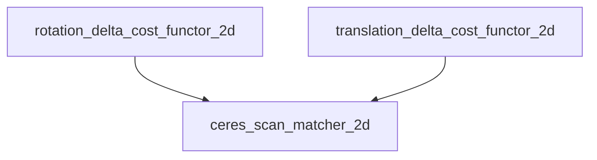

ceres_scan_matcher_2d

ceres扫描匹配器，完成ceres扫描匹配整个动作。

correlative_scan_matcher_2d

相关扫描匹配器，是实时相关扫描匹配器和快速相关扫描匹配器的基类。

其中定义了扫描窗口的基本概念。

fast_correlative_scan_matcher_2d

快速相关扫描匹配器，用来做闭环检测，核心技术是滑动窗口与分支定界算法。

interpolated_tsdf_2d

与TSDF地图相关，不做探究。

occupied_space_cost_function_2d

占据空间代价函数，在ceres扫描匹配器模块中被调用。

real_time_correlative_scan_matcher_2d

实时相关扫描匹配器，在前端中作为ceres扫描匹配的前置手段，产生较为准确的初始位姿估计，供后者使用。

rotation_delta_cost_functor_2d

旋转差值代价函数，在ceres扫描匹配器模块中被调用。

translation_delta_cost_functor_2d

平移差值代价函数，在ceres扫描匹配器模块中被调用。

tsdf_match_cost_function_2d

TSDF地图相关，此处不做探究。

本文意在对Ceres扫描匹配器模块的功能和原理做一个系统的描述和解释。

-----------
调用：
本模块最高层的，无法是三个扫描匹配器。它们在哪里被调用？

local_trajectory_builder_2d 调用了ceres和实时的Match方法

constraint_builder_2d 调用了fast和ceres的Match方法, 其中有fast的MatchFullSubmap